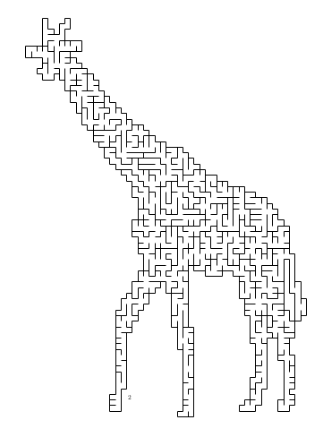
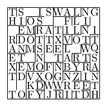

# maze-gen-text

A maze generator that supports text snakes and outputs tikz code.

I used this for creating birthday invitations for my child.

## Features

 - generates rectangular mazes or mazes with arbitrary shape from a b/w png file
 - can embed text strings into the mazes. The embedded text strings have no forks and are surrounded by unreachable mazes
 - output is LaTeX TiKZ code, if `standalone` is selected the output file is compilable and will be compiled to a pdf using `latexmk`

## Example

### Shape input as PNG
If you have the following image as `giraffe.png`:

You can run `java -jar spell-labyrinth-assembly-1.0.jar --standalone --image src/test/resources/giraffe.png` and get [this pdf](examples/giraffe.pdf).

Note that you need a LaTeX installation for this to work. The image has to be black and white.

### Text filling

The commandline `java -jar spell-labyrinth-1.0.jar --fill --width 10 --height 10 --text "(0,0)THIS IS SOME RANDOM TEXT TO DEMONSTRATE TEXT FILLING INTO LABYRINTH(9,9)" --standalone` yields [this pdf](examples/with-text.pdf).

You can add start and end coordinates to the given text.

At the time of writing, I don't know whether this is mandatory. I also don't know if text filling can be combined with shape from image,
but I think so. Be sure to place your coordinates within the image. There is no reasonable error reporting.
If you have any problems with this program, you can file an issue.

## Downloading

You can get a recent version from the [Releases Page](https://github.com/ziggystar/maze-gen-text/releases).
 
 To run this program, you'll need at least a JRE installed. [Link to Oracle Java](https://www.oracle.com/technetwork/java/javase/downloads/jre8-downloads-2133155.html)
## Building

To build this project, you need to install [SBT](https://www.scala-sbt.org/) or use any modern Scala IDE.

The task `sbt assembly` will create a runnable jar. You can also download a binary from the releases page.
